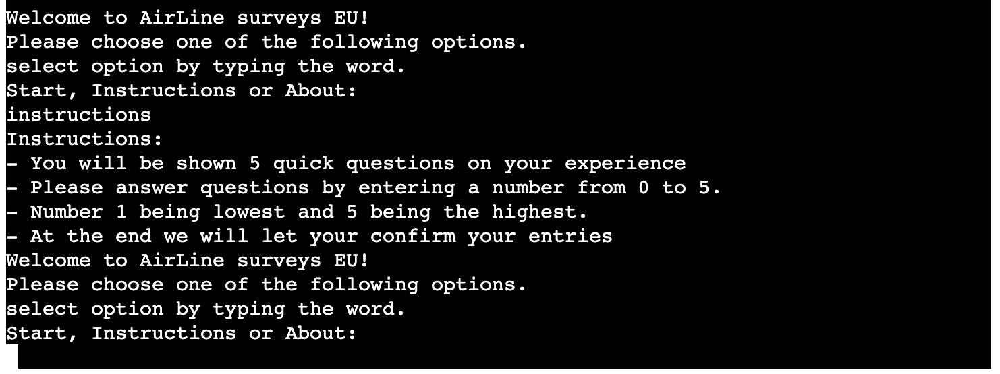
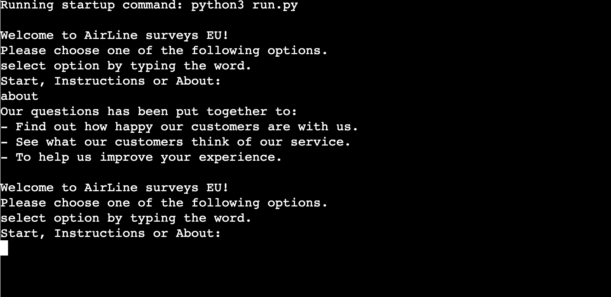
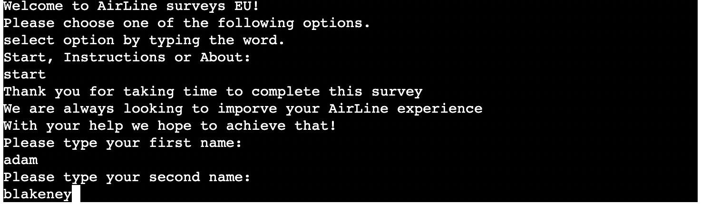
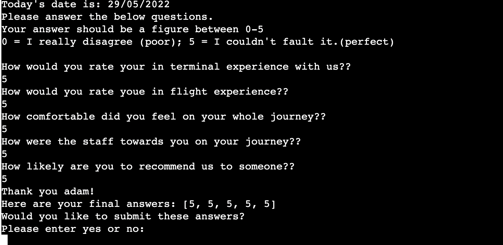
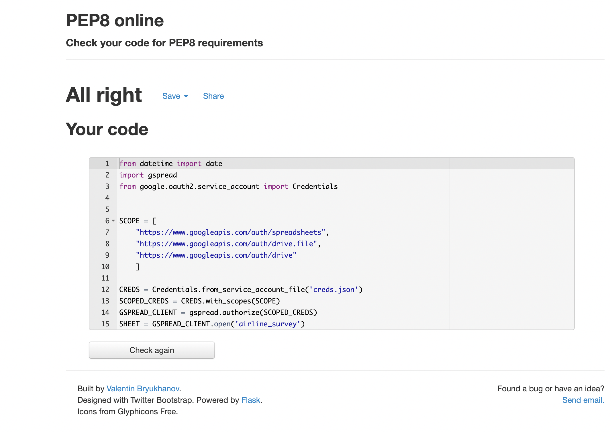

<h1>Airline Survey</h1>

The project has been undertaken to create a survey/form that czrries ourt a logical flow and is interactve using python as the programming language.

Visit Airline survey here [here](https://airline-survey.herokuapp.com/).

The aims of this site is to give the user a qick and easy flow into giving a review for the company involved and aminly giving the company detsailed and specific information

# Table of Contents:
- [**UX**](#ux)
  * [User aims](#user-aims)
  * [Strategy](#strategy)
  * [Structure](#structure)
- [**Features**](#features)
  * [1. Intro](#1-intro)
  * [2. About](#2-about)
  * [3. Instructions](#3-instructions)
  * [4. Form](#4-form)
  * [5. Questions](#5-questions)
  * [6. Submit](#6-submit)
- [**Technologies used**](#technologies-used)
  * [Websites](#websites)
- [**Testing**](#testing)
  * [Code Validators](#code-validators)
  * [Manual Testing](#manual-testing)
  * [Bugs and Fixes](#bugs-and-fixes)
  * [Improvements](#improvements)
- [**Deployment**](#deployment)
  * [heroku deployment:](#heroku-deployment)

# **UX**
## 1. User aims
Here I have a list I created of things  that I would look for/ expcet in a website as a user.

As a user, I would like to quickly and effectively understand the purpose and information of the site.
As a user, I need to be able to easily navigate the website.
As a user, I would like to use the site on mobile and desktop.

Returning Users

As a returning user, I would like to be able to get straight into the review without needed to read instructions again.(use of 'start' command)

## 2. Strategy
Project goals

The aim of this project is to build a survey with a key focus on python to create a seamless survey platform with a way of storing data.

## 3. Structure

The structure of the survey is used through heroku, with is essentially an online terminal, by doing this this can make it easily accexibly by an user any where.

# **Features**

## 1. Intro
This is the most important part of my code. this has to be clear and functioning perfect for the rest of the code to be useful. this is where the user discovers the survey how it works and how the user can start to fill it out. Below is a picture of the intro code with is displayed to user.

## 2. About
The about section gives a brief insight into the purpose of the survey and where it is coming from. This can be a big help not only to the user but also to company as it can creat raport with the user leading to better info.

## 3. Instructions
This section is also very similar to ab out, but now it gives the user all the information they need ot complete the survey but also what they can expect to come up so they are prepared.

## 4. Form
On selecting start the user will be greeted with a quick form with requires the input of name. This is a pre requisit to the questions section that follows.

## 5. Questions

This section holds all the questions in the survery. It is very straing forward using a 1-5 number scale.
i have left apicture below as it shows all the information held within the section.

## 6. Submit
The final part of the survey is a confirmation to the user that lets the review their answers and decide if they are ready to submit.
If so then it leaves them with a message of apprections for partaking.

# **Technologies used**
## Websites

In the creation of this website there were multiple websites I used. Below is a list to credit them and their use in my site.
__heroku__
Used for the deployment of my website
(https://dashboard.heroku.com/)

__google console__
This was used as my api which allowed me to stroe my data from the users completeing the survey to my google sheets
(https://console.cloud.google.com/)

__google sheets__ 

This is where my data will be stored and displayed on a spreadsheet.
(https://docs.google.com/spreadsheets/d/1Y-2A2vaMv-I1IvXntcgYEPUtnacOLG4zgp6UGNxQ7AM/edit#gid=0)
# **Testing**

## Code validators 
I used 2 code validators for my site one for the html and one for the css.

 __python__
 (http://pep8online.com/checkresult)
 

## Manual testing

The maual testing i done was mainly carried ut by using the command {python3 run.py}.
this gave me a preview of the code ive just added in the terminal. So this would show me if the code has actually worked whether or not if the code is written correcly or not. 

By doing this it would also allow me to interact with my code and see what the user is going to experience.

I also sent to friends and family in order to get them to use the site and report and bugs or imporvements.

## Bugs and Fixes

During this project I ran in to countless bugs issues and things I would have to just take a different approch with as I couldnt get it how I wanted.

Here i will explaian one briefly.

Getting the code to run in order and call the correct functions at the correct time.
Also, i ran in to  ultiple errors such as 1. code too long, 2. incorect indents and 3. certain variables not given value.

Overall i found this project very difficult. 
## Improvements

There are three things I identified during my project and on review that I was unable to do, for lack of knowledge that I would have liked to incorporate. I hope to learn how to do this to be able to incorporate in future projects.

I would like to add more feautures, such as adding more options and add more user information.

I would like to add more interactivity and give the user more spce to give more specific information.

# **Deployment**
## heroku deployment 

This project was deployed using Code Institute's mock terminal for Heroku.

__steps for deployment__
    - Create a new Heroku app.
    - Under the settings tab for the new app, go to the Config Vars section.
    - Add `PORT` in the KEY section and add `8000` into the VALUE section
    - Still in the settings tab, go to the Buildbacks section.
    - Click "Add Buildbacks" and choose `Python` and then `NodeJS` in that order.
  
            - Open the Terminal in your Gitpod workspace.
            - Enter the command `heroku login -i` to login to your Heroku account.
            - Enter the command `heroku apps` to get the app name for this repo.
            - Enter the command `heroku git:remote -a app_name` with `app_name` replaced with the app name you created.
            - Add and commit any changes to your code if applicable.
            - Push code to both GitHub & Heroku by using the below commands:
                - GitHub: `git push origin main`
                - Heroku: `git push heroku main`

